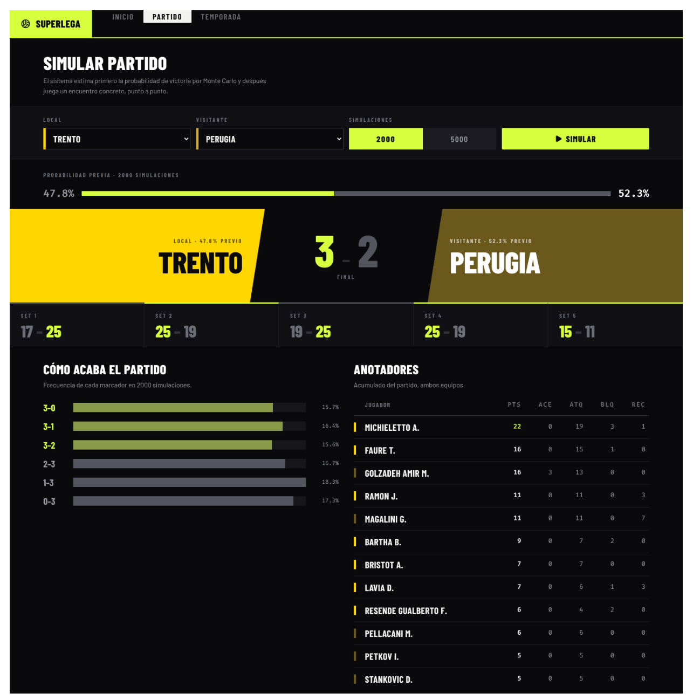
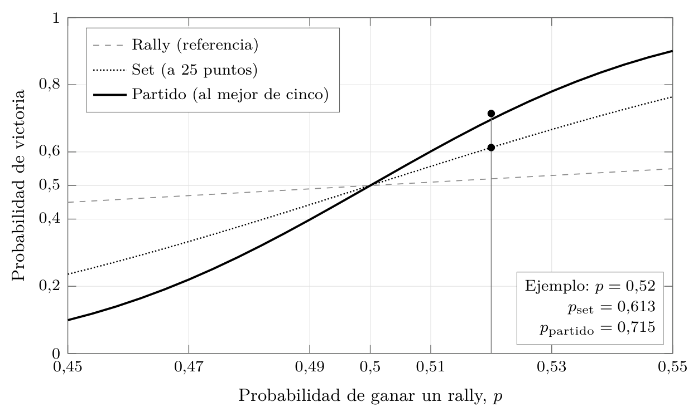
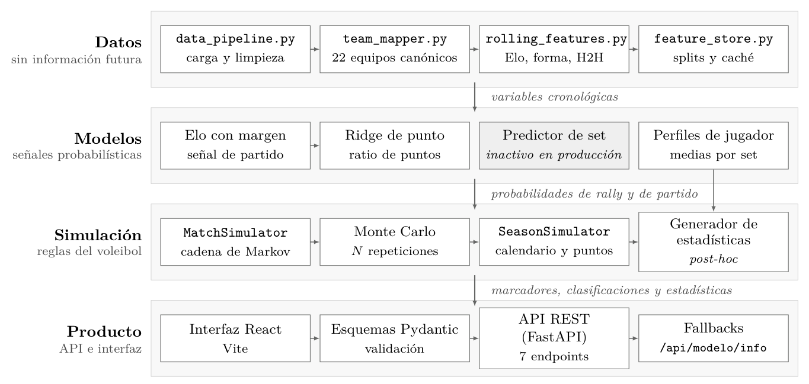
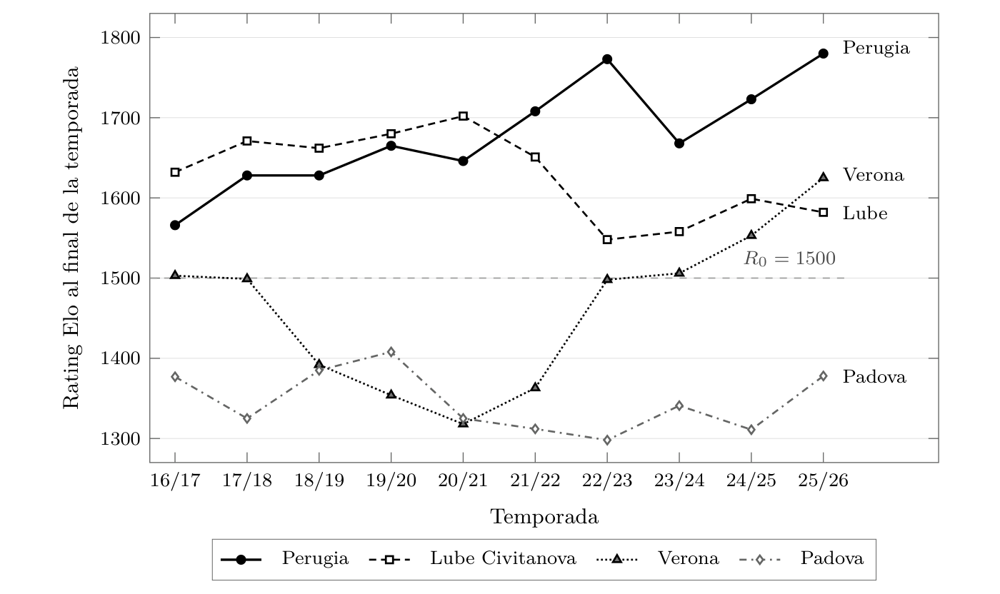
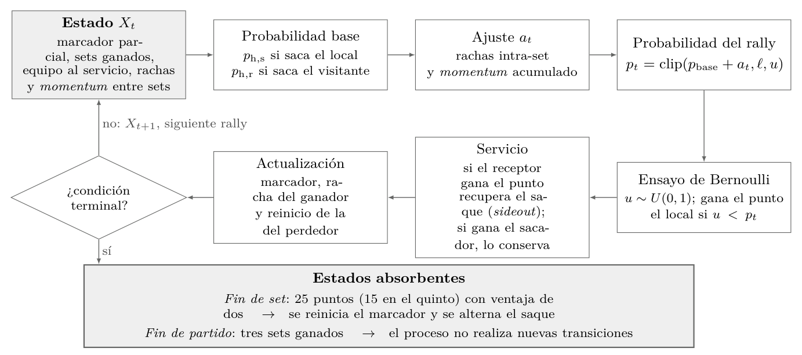
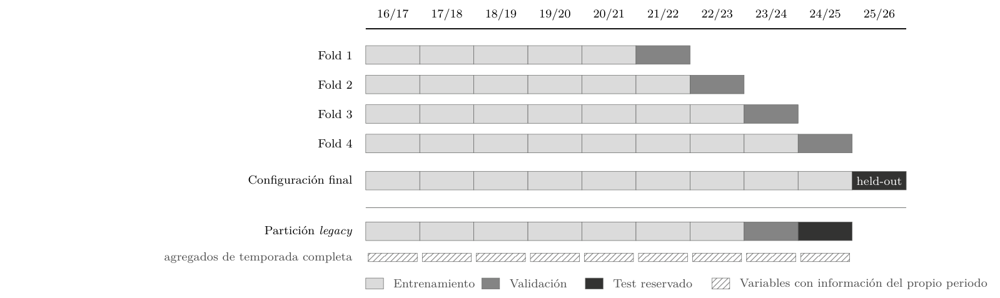
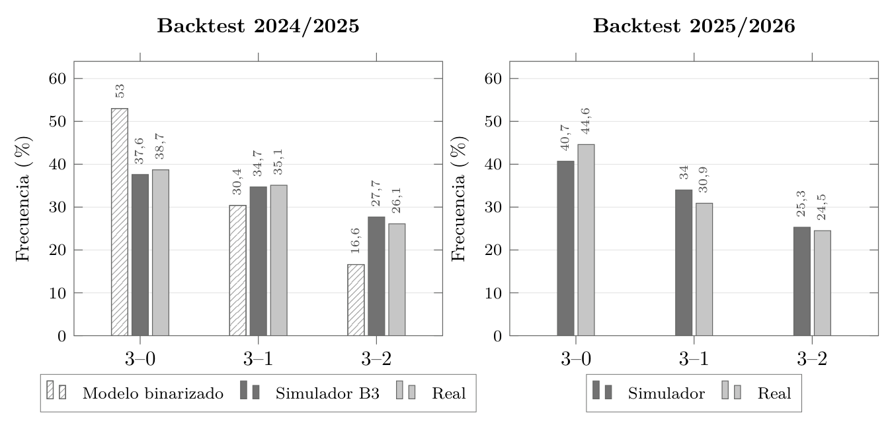
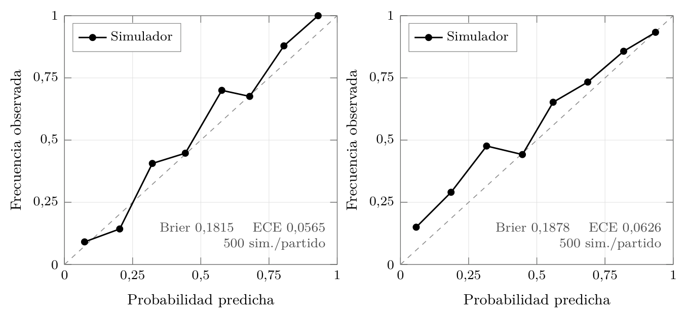
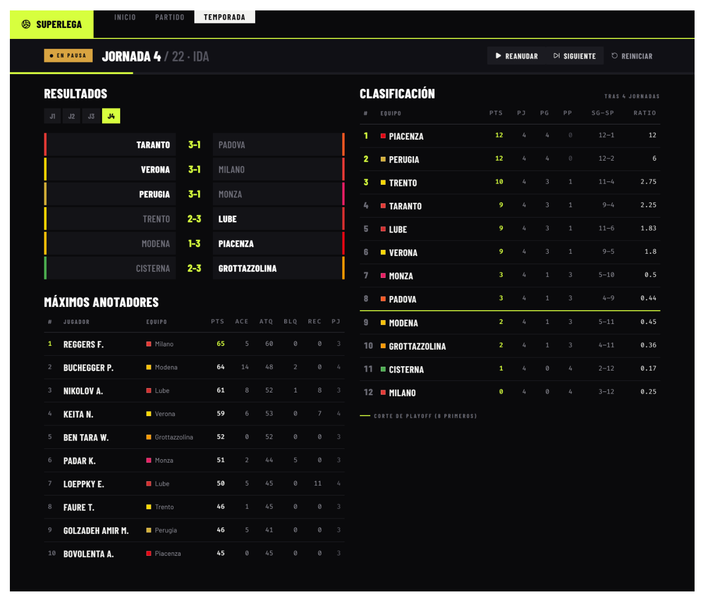

<div align="center">

# 🏐 SuperLega Simulator

**Probabilistic match and season simulator for the Italian men's volleyball league (SuperLega)**
Elo rating · Ridge point model · Markov chain · Monte Carlo

[](https://superlega-predictor.onrender.com)

[](https://github.com/asormar/superlega-simulator/actions/workflows/ci.yml)




*Bachelor's thesis · Universitat Politècnica de València · graded **10/10***

</div>

---

## Table of contents

- [Overview](#overview)
- [Why simulate point by point?](#why-simulate-point-by-point)
- [How it works](#how-it-works)
- [Results](#results)
- [The web app](#the-web-app)
- [Getting started](#getting-started)
- [API](#api)
- [Project structure](#project-structure)
- [Deployment](#deployment)
- [Academic context](#academic-context)

## Overview

SuperLega Simulator predicts and simulates matches and full seasons of the Italian
**SuperLega**, built on a history of **1,322 matches (5,073 sets)** across ten seasons
(2016/17 – 2025/26), collected from the official Lega Pallavolo Serie A portal and
normalised to 22 canonical clubs.

Instead of classifying the winner directly, the system **plays every match rally by
rally**. Each run ends with a concrete score, and thousands of Monte Carlo runs yield
both the win probability and the full distribution of final scores (3–0, 3–1, 3–2…).

Three components work together:

| Component | Role |
| --- | --- |
| **Margin-adjusted Elo rating** | Summarises each team's relative strength and updates sequentially after every match. No training phase. It is the production match signal. |
| **Six-feature Ridge regression** | Translates the strength gap into the probability of winning a single rally. |
| **Markov chain simulator** | Replays the match point by point under official volleyball rules and, via Monte Carlo, returns win probabilities and score distributions. |

> [!IMPORTANT]
> Every feature is built **only from information available before the match being
> predicted**, and evaluation follows a **rolling-origin** scheme. No data from the
> future ever leaks into training.

## Why simulate point by point?

Volleyball's scoring structure **amplifies small rally advantages**. A team that wins
52 % of rallies wins a set about 61 % of the time and a best-of-five match about 72 %
of the time. Modelling the rally as the minimal unit lets the simulator capture this
non-linearity naturally, instead of learning it from a small dataset.

<div align="center">

<br><sub>Rally → set → match amplification. With p = 0.52, p<sub>set</sub> = 0.613 and p<sub>match</sub> = 0.715.</sub>
</div>

## How it works

### Four-layer architecture

<div align="center">

</div>

| Layer | Responsibility | Key modules |
| --- | --- | --- |
| **Data** | Loading, cleaning, canonical team names, chronological features (Elo, form, head-to-head) | `src/data/` |
| **Models** | Margin Elo (match signal), Ridge point model, player profiles | `src/models/` |
| **Simulation** | Volleyball rules as a Markov chain, Monte Carlo, full-season calendar and standings | `src/simulation/` |
| **Product** | REST API with Pydantic validation, React interface | `src/api/`, `src/web/` |

### Match signal: margin-adjusted Elo

Home advantage of 60 Elo points, K = 28, and a margin multiplier of **1.00 for 3–2,
1.15 for 3–1 and 1.30 for 3–0**. Between seasons, ratings regress 25 % towards 1500
to reflect roster turnover.

<div align="center">

</div>

### The rally as a Markov chain transition

Each state holds the partial score, sets won, serving team, streaks and between-set
momentum. The rally is a Bernoulli trial on the adjusted probability; serve and
side-out rules decide who serves next, until an absorbing state ends the set (25
points, 15 in the fifth, win by two) or the match (three sets).

<div align="center">

</div>

### Point model: Ridge on a continuous target

The target is the continuous point ratio `y = P_home / (P_home + P_away)`, which keeps
the *magnitude* of superiority instead of a binary win/loss. It uses six differential
features: Elo rating, win rate, set performance, set dominance, set ratio and
recency-weighted form.

### Rolling-origin validation

Training always precedes the validated season. The window grows as the origin moves
(four folds), and **2025/26 is held out** from any training or tuning.

<div align="center">

</div>

## Results

### Held-out season 2025/26

| Target | n | Log-loss | AUC | Brier | Accuracy |
| --- | ---: | ---: | ---: | ---: | ---: |
| Match | 314 | 0.5677 | 0.7624 | 0.1930 | 0.7038 |
| Set | 1,193 | 0.6218 | 0.6970 | 0.2164 | 0.6505 |

### Temporal audit: one honest signal beats 87 leaky features

An earlier supervised predictor with 87 features reported an AUC of 0.707 on a single
split. Re-evaluated chronologically, it dropped to **0.528**, indistinguishable from
chance. Several of its features contained information from the match's own season.

| Metric | Reported (87 features, single split) | Audited (87 features, chronological) | **Final system (margin Elo)** |
| --- | ---: | ---: | ---: |
| AUC | 0.707 | 0.528 | **0.762** |
| Log-loss | n/a | 0.694 | **0.568** |
| Brier score | n/a | 0.251 | **0.193** |
| Accuracy | 0.514 | 0.514 | **0.704** |

### Realistic score distributions

Moving from a binarised point model to the continuous Ridge target lets the simulator
reproduce the real 3–0 / 3–1 / 3–2 distribution, with an **L1 distance of 0.0315** in
the 2024/25 backtest.

<div align="center">

</div>

| 2024/25 backtest | Binarised | **Continuous** |
| --- | ---: | ---: |
| Brier | 0.2731 | **0.1815** |
| ECE | 0.2419 | **0.0565** |
| L1 (scores) | 0.2858 | **0.0315** |

### Calibration

<div align="center">

<br><sub>Reliability curves, 500 simulations per match. 2024/25: Brier 0.1815, ECE 0.0565 · 2025/26: Brier 0.1878, ECE 0.0626.</sub>
</div>

### Adoption criterion

Every candidate improvement had to pass **four conditions, fixed before evaluating**:
improve validation, beat measurement noise (0.005), also improve on 2025/26, and carry
real weight in the model. Most ideas did not make it:

| Hypothesis | Evidence | Decision |
| --- | --- | --- |
| Set predictor at saturation | Sweep picks Elo weight = 1.0 | ❌ Rejected |
| Set–match blend | Improves 2 of 4 folds, below noise | ❌ Rejected |
| Momentum constants | Grid 0.00157 < seed noise 0.00341 | ❌ Rejected |
| Optuna optimisation | +0.082 on validation, −0.060 on test | ❌ Rejected |
| **Margin Elo** | Better in all four seasons | ✅ Adopted |
| **Continuous Ridge** | Brier 0.2731 → 0.1815 | ✅ Adopted |

Figures are regenerated with `python -m src.models.precision_report` and stored in
`models/precision_improved.json`, which is the source the API serves.

## The web app

👉 **[superlega-predictor.onrender.com](https://superlega-predictor.onrender.com)**

- **Match**: pick home and away teams, run 2,000 or 5,000 simulations, and get the win
  probability, a concrete point-by-point match with set scores, the final-score
  distribution and a generated box score per player.
- **Season**: simulate a full regular season matchday by matchday (pause, step or
  restart) with live standings, the playoff cut and top scorers.

<div align="center">

</div>

> [!NOTE]
> The demo runs on Render's free plan. If it has been idle, the first request can take
> up to a minute while the instance wakes up.

## Getting started

**Requirements:** Python ≥ 3.10 and Node.js ≥ 18.

```bash
git clone https://github.com/asormar/superlega-simulator.git
cd superlega-simulator
pip install -e ".[test]"
```

The trained models are versioned in `models/`, so the API starts without retraining:

```bash
python -m src.api.main
```

The API listens on `http://localhost:8000`. In a second terminal, start the frontend:

```bash
cd src/web
npm install
npm run dev
```

Vite serves on `http://localhost:5173` and proxies `/api` to the backend. To ship a
single app instead, `npm run build` produces `src/web/dist/`, which the API mounts at
`/` on startup.

<details>
<summary><b>Run with Docker</b></summary>

```bash
docker build -t superlega-simulator .
docker run -p 7860:7860 superlega-simulator
```

Open `http://localhost:7860`.

</details>

<details>
<summary><b>Retrain from the raw data</b></summary>

The full pipeline, starting from the CSV files in `DB/`:

```bash
python -m src.data.data_pipeline      # load and normalise
python -m src.data.feature_store      # build features
python -m src.models.train            # train and persist
```

</details>

<details>
<summary><b>Tests and linting</b></summary>

```bash
pytest -q -m "not slow"    # fast suite (runs in CI)
pytest -q                  # includes tests that need the trained models
ruff check src/ tests/ && black --check src/ tests/
```

CI runs lint and tests on both Ubuntu and Windows on every push to `main`.

</details>

## API

| Method | Route | Description |
| --- | --- | --- |
| `GET` | `/api/equipos` | Available teams and their strength |
| `GET` | `/api/equipos/{nombre}` | Team detail and roster |
| `POST` | `/api/simular/partido` | Single match or Monte Carlo run |
| `POST` | `/api/simular/temporada` | Full season |
| `POST` | `/api/simular/temporada/iniciar` | Initialise a matchday-by-matchday season |
| `POST` | `/api/simular/temporada/jornada` | Simulate a specific matchday |
| `GET` | `/api/modelo/info` | System components and their metrics |

Interactive docs are available at `/docs` (Swagger UI) when the API is running.

## Project structure

```
DB/               Raw CSV/XLSX data: results, set scores, team and player stats
models/           Trained artifacts and evaluation metrics
memoria/          Technical notes for each component (Spanish)
docs/img/         Figures used in this README
src/data/         Loading, normalisation and feature construction
src/models/       Training, evaluation and experiments
src/simulation/   Markov chain, match and season simulators
src/api/          FastAPI REST service
src/web/          React + Vite interface
tests/            Test suite
```

## Deployment

The live demo is a single Docker container (FastAPI serving the API and the built
React app) deployed on **Render** through the [`render.yaml`](render.yaml) blueprint.

- **Always up to date:** every push to `main` triggers a redeploy once CI passes
  (`autoDeployTrigger: checksPass`).
- **Always awake:** Render's free plan spins services down after 15 minutes without
  traffic. The [`keep-alive`](.github/workflows/keep-alive.yml) workflow pings the app
  every 10 minutes to keep it warm.

## Academic context

This project is the Bachelor's thesis (*Trabajo Fin de Grado*) for the **Degree in
Digital Technology and Multimedia** at the **Escuela Técnica Superior de Ingeniería de
Telecomunicación, Universitat Politècnica de València**, defended in September 2026
and graded **10/10**.

> *Desarrollo de un modelo predictivo basado en Machine Learning para la estimación de
> resultados y análisis de rendimiento en el voleibol profesional*
> (Development of a Machine Learning predictive model for result estimation and
> performance analysis in professional volleyball)

- **Author:** Alejandro Sorolla Martínez
- **Supervisor:** María Rocío del Amor del Amor

Main contributions:

1. **Strictly chronological evaluation.** No feature uses information from after the match.
2. **Probabilistic quality measured, not just accuracy.** Brier score, log-loss and ECE.
3. **Simulated distributions checked against reality.** The simulator reproduces real score distributions.

The work is aligned with **SDG 9, target 9.5**: reproducible, open analysis
infrastructure for a domain with little prior coverage.

**Data source:** [Lega Pallavolo Serie A](https://www.legavolley.it) (results,
standings and historical statistics).
